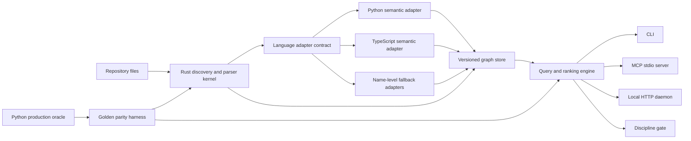

# CodeSextant SOTA Open-Source Release Gate — Design

## 1. Decision

CodeSextant will not be published as a merely functional repository. It will be
published only after it passes a reproducible release gate designed to make it
competitive with the strongest current code-intelligence tools on every core
dimension except two explicitly accepted disadvantages:

1. community size at launch; and
2. breadth of supported programming languages at launch.

The current Python implementation remains the production correctness oracle until
the replacement kernel reaches behavioral parity. The existing TypeScript rewrite
is not discarded, but it is no longer assumed to be the final performance kernel.
Its reusable tests, protocol work, and language-service integration become inputs
to a new architecture whose hot path is a native Rust kernel.

No public repository, package, benchmark claim, or Claude for Open Source
application is allowed before the applicable gates in this document are green.

The user explicitly rejected a staged public beta or “publish now, repair later”
path on 2026-07-23. Every issue identified in the competitive and release audit
must be resolved and independently verified before GitHub publication. Anthropic
review is later still: it begins only after the complete public release itself has
been verified. A private release candidate, partial Rust port, documentation-only
shell, or benchmark promise is not eligible for publication or submission.

## 2. Why this design exists

CodeSextant already has useful differentiation:

- high- and low-confidence reference resolution instead of pretending every edge
  is equally trustworthy;
- a singleton daemon shared by multiple agents;
- per-project SQLite shards, incremental indexing, sparse PageRank, call graphs,
  impact analysis, dead-code, unwired-code, duplicate-code, comment, health, and
  AI-usage queries;
- a discipline gate that rejects newly introduced debt while allowing an explicit
  baseline of existing debt; and
- hard-earned Windows reliability work around daemon ownership, restart, queue
  limits, health checks, and multi-agent contention.

It is not yet defensible as state of the art. The current release blockers include:

- no standard MCP server interface;
- no one-command, cross-platform, runtime-independent install;
- no fair public benchmark against the strongest comparable tools;
- noisy map ranking caused by tests, tools, generated files, proof-of-concept code,
  and trivial one-letter symbols;
- TypeScript semantic resolution that is too slow for an interactive product;
- Python control-plane starvation risk under heavy CPU work;
- incomplete English documentation and open-source governance;
- incomplete supply-chain evidence, provenance, SBOM, signing, and threat model;
  and
- version-source drift (`pyproject.toml` and `codesextant.__init__`).

The current tree also has public-export hazards that must be treated as product
defects, not documentation polish: machine-specific paths and fixtures, internal
artifacts, a private handoff-skill dependency in a daemon route, heavy GET routes
on loopback without an origin/authentication policy, and informal source comments
that say an algorithm was “copied” even where the intended meaning was public-idea
inspiration. These are blocked from release until the implementation and its
provenance record tell the same accurate story.

The release gate converts these weaknesses into measurable work instead of hiding
them behind marketing language.

## 3. Goals and non-goals

### 3.1 Goals

- Provide precise code navigation and change-impact answers with transparent
  confidence and provenance.
- Make the same indexed truth available through CLI, MCP stdio, and local HTTP.
- Keep warm queries fast enough for an agent to use repeatedly without hesitation.
- Survive multiple agents, process crashes, interrupted writes, and large repos
  without database corruption or daemon duplication.
- Be easy to install, update, diagnose, and uninstall on Windows, macOS, and Linux.
- Publish an independently reproducible benchmark with fixed datasets, commits,
  commands, raw outputs, and statistical treatment.
- Establish a clean-room provenance trail that makes independent implementation
  obvious and auditable.
- Produce a truthful evidence packet for the discretionary ecosystem-impact path
  of Claude for Open Source.

### 3.2 Non-goals for the first public release

- Matching competitors' language count.
- Matching established projects' stars, contributors, integrations, or community
  support on day one.
- Becoming an IDE or autonomous coding agent.
- Editing or refactoring source code. CodeSextant answers questions and enforces
  analysis policies; another tool performs edits.
- Claiming universal semantic precision for languages that only have a
  name-resolution adapter.
- Publishing benchmark wins that are not reproduced from the public harness.

## 4. Prior art and clean-room boundary

The comparison set is based on public product documentation, papers, release
artifacts, and benchmark descriptions. It includes:

- [CodeGraph](https://github.com/colbymchenry/codegraph)
- [Codebase Memory MCP](https://github.com/DeusData/codebase-memory-mcp)
- [Code Review Graph](https://github.com/tirth8205/code-review-graph)
- [Serena](https://github.com/oraios/serena)
- [CodeGraphContext](https://github.com/CodeGraphContext/CodeGraphContext)
- [Codanna](https://github.com/bartolli/codanna)
- [tree-sitter-analyzer](https://github.com/aimasteracc/tree-sitter-analyzer)
- [Aider's repository map](https://github.com/Aider-AI/aider)
- [SCIP](https://github.com/scip-code/scip)

The implementation team must not copy competitor implementation code. Research is
limited to public README files, papers, issue descriptions, benchmark protocols,
and documented interfaces. Every adopted idea is recorded in a prior-art ledger
with its source, the abstract idea learned, and CodeSextant's independent design
decision. No source excerpt is pasted into product code or documentation.

Before release, a provenance report must establish:

- CodeSextant's pre-research commit history and dates;
- authorship of each shipped source file;
- all third-party dependencies and licenses;
- all generated files and generators;
- any code imported from a third party, with license and exact origin; and
- a similarity scan of the released source against locally available third-party
  source, where legally and technically possible.

`THIRD_PARTY_NOTICES.md`, `PROVENANCE.md`, and the prior-art ledger are release
artifacts, not optional internal notes.

Public release preparation happens in a new allowlist-based export clone. History
is never rewritten in the private working repository. The export preserves the
safe authorship timeline while removing private paths, internal operational files,
secrets, and personal email metadata that is not intended for publication. If any
shipped code is actually derived from a third party, its required license and
notice are preserved; wording changes are never used as a substitute for license
compliance.

## 5. Target architecture

### 5.1 Native kernel

The Rust kernel owns the performance-sensitive and concurrency-sensitive work:

- repository discovery and ignore-rule evaluation;
- file fingerprinting and incremental invalidation;
- tree-sitter parsing;
- normalized symbol and edge records;
- SQLite transactions and schema migration;
- PageRank and other graph projections;
- call-graph, reference, impact, dead-code, and map query hot paths;
- bounded work queues, cancellation, deadlines, and resource accounting; and
- the shared protocol used by all presentation surfaces.

The kernel must not embed language-specific semantic assumptions in generic graph
code. Language resolution is selected through a data-driven adapter registry.

Windows native bindings have one workspace-level feature-set authority. The exact
`windows-sys` set is `Win32_Foundation`, `Win32_Globalization`,
`Win32_Security`, `Win32_Security_Authorization`, `Win32_Storage_FileSystem`,
`Win32_System_Memory`, `Win32_System_JobObjects`, `Win32_System_Threading`, and
`Win32_System_SystemInformation`. Crates may consume that shared declaration but may
not narrow, expand, or duplicate it. Every Cargo dependency change performs one
reviewed lockfile update, verifies that only expected exact versions changed, and
only then runs all later Cargo commands with `--locked`.

### 5.2 Language adapter contract

Each adapter declares:

- language IDs and file extensions;
- parser and resolver versions;
- capabilities (`symbols`, `imports`, `references`, `calls`, `types`);
- confidence classes it can emit;
- degradation behavior when a language server or dependency is unavailable;
- resource limits and cancellation support; and
- deterministic test fixtures.

Initial precision adapters are Python and TypeScript/JavaScript because they have
existing production behavior and known performance evidence. Other supported
languages may ship with tree-sitter symbols and explicitly labeled name-level
edges. The user must always be able to see which resolver produced an answer.

### 5.3 Python oracle and TypeScript rewrite disposition

The current Python engine remains the oracle for behavior already covered by tests.
It is not removed until a parity manifest shows that every public query and every
accepted edge class either matches or has an approved intentional difference.

The oracle is immutable for a parity run. `tests/fixtures/oracle-manifest.json`
binds the Python commit SHA, package version, engine version, schema version,
fixture/corpus SHA-256 values, and generator version. CI may verify expected output
but may not regenerate and accept expected output automatically. Updating the
oracle requires a reviewed manifest change in a separate commit. Parity includes
golden fixtures and differential runs on real repositories, not only synthetic
samples.

Every oracle generator, including the later full public-operation oracle, executes
from an isolated materialization of the bound commit using the hash-locked Python
distribution, `-I`, a closed environment, an executed-module manifest, and a
current-versus-historical mutation barrier. The manifest binds interpreter and
distribution-closure digests. A live worktree, ambient site package, or output
directory check alone can never mint accepted golden bytes.

The TypeScript rewrite is frozen as a standalone replacement effort. Reusable
parts are retained as one of:

- TypeScript/JavaScript semantic adapter code;
- protocol conformance fixtures;
- golden-output fixtures; or
- discarded experiments documented in the migration record.

This avoids a sunk-cost rewrite while preventing Node.js process startup and
language-service latency from defining the whole product's performance floor.

### 5.4 Versioned graph store

The graph store is a single source of truth shared by CLI, MCP, and HTTP. Its schema
must include at least:

- repository identity and canonical root;
- file content hash, language, size, and last indexed revision;
- symbol identity stable across unchanged revisions;
- typed edges with resolver, confidence, and evidence location;
- graph and adapter version metadata;
- query-cache revision keys; and
- migration state and recovery journal.

Every write batch is atomic. A crash can lose unfinished work but cannot expose a
partially committed graph as current. Schema migrations are forward-only and are
tested against the last two public schema versions.

One migration registry is the schema-version authority. It distinguishes bootstrap
schema from current schema and defines every supported transition. Empty databases,
v4, v5, current v6, and future-version inputs must make bootstrap, preflight,
migration, doctor, and runtime report the same current-version decision; no bundled
`schema.rs` constant may remain frozen at v4 after v6 becomes current.

### 5.5 One engine, three surfaces

CLI, MCP stdio, and local HTTP are thin adapters over the same query service.
They must not duplicate ranking, filtering, confidence, or exclusion logic.

`spec/operations.yaml` is the operation single source of truth. It defines names,
parameters, JSON schemas, stable error codes, confidence semantics, side-effect and
cost classification, and transport exposure. `spec/openapi.yaml`, Rust protocol
types, CLI bindings, MCP tools, HTTP routes, and documentation are generated or
validated from this registry. A contract suite proves parity across all three
surfaces and prevents the current drift in which CLI, client, daemon routes, health
metadata, and README expose different subsets.

The public query contract covers:

- `status`, `doctor`, and health;
- `index` and incremental refresh;
- symbols and definitions;
- references and callers;
- call graph;
- repository map;
- impact analysis;
- dead and unwired code;
- duplicates and comments;
- AI-usage analysis; and
- discipline-policy evaluation.

Every result envelope includes schema version, repository revision, freshness,
coverage, confidence distribution, truncation/sampling, elapsed time, and warnings.
The crate dependency DAG is explicit and cycle-checked. The chosen first-release
direction is `codesextant-core -> codesextant-protocol`; QueryService manifests and
the reviewed Cargo lockfile must carry that edge in the same task that introduces
the protocol types.

### 5.6 Ranking and noise control

The map must rank product concepts, not merely high-degree syntax artifacts.
The default ranking pipeline therefore separates:

1. repository classification: product, tests, examples, benchmarks, generated,
   vendored, build output, tool, and proof-of-concept;
2. symbol quality: meaningful declarations versus trivial/local/generated names;
3. graph authority: high-confidence semantic edges versus lower-confidence name
   edges; and
4. user intent: overview, change impact, debugging, onboarding, or audit.

Defaults exclude generated, vendored, build, and proof-of-concept content and
down-rank tests/tools. Users can include them explicitly. One-letter local symbols
cannot enter the default repository map without evidence of public API importance.

Ranking remains deterministic for the same index revision and configuration. Every
ranked result can explain its score components.

### 5.7 Discipline layer

The existing debt-baseline behavior becomes a first-class policy engine:

- policy is declarative and versioned;
- current debt can be baselined with an owner and expiration;
- newly introduced debt fails with a stable non-zero exit code;
- suppressions require a reason and source location;
- the gate can emit JSON, SARIF, and human-readable output; and
- CI examples are provided for GitHub Actions without making GitHub Actions the
  only supported runner.

## 6. Failure model and recovery

The system must distinguish these conditions instead of collapsing them into a
generic failure:

- unsupported language;
- supported parser but unavailable semantic resolver;
- stale index;
- partial coverage due to deadline or resource cap;
- daemon unavailable;
- port owned by another process;
- schema mismatch;
- corrupt database;
- cancelled query; and
- internal defect.

Read queries fail closed on corrupt or mismatched graph state. If a semantic adapter
fails, the response may degrade to lower-confidence data only when the degradation
is explicit in the response. It must never relabel fallback data as high confidence.

The daemon retains the proven singleton and per-project isolation model. Recovery
is bounded: one automatic restart and one request retry, followed by a stable error
with diagnosis. No retry loop is unbounded.

Loopback is not treated as an authentication boundary. Every heavy or stateful
HTTP operation, including an index triggered through a nominally read-oriented
route, must use an explicit method and pass the same origin/authentication policy.
Cross-origin browser requests are denied by default. Expensive operations expose
cost/deadline metadata and cannot be smuggled into an unauthenticated GET. Private
AI King skills and home-directory paths are absent from the public daemon.
The policy validates the actual `Host`, normalized loopback authority, `Origin`,
preflight, and `Sec-Fetch-Site` relationship. Foreign or `null` origins, Host spoofing,
DNS-rebinding names, forwarded authority, wildcard hosts, and unapproved preflights
fail closed; only absent-origin non-browser clients or an explicitly allowlisted
same-origin loopback authority may proceed after bearer authentication.

## 7. Benchmark design

### 7.1 Rules

All competitors are run from pinned public releases or commits on identical
hardware and repository checkouts. Every command, configuration, timeout, warm-up,
raw output, and failure is published. Results are separated by supported language;
unsupported cases are not silently scored as zero or omitted from averages.

The benchmark protocol is committed before the scored run. Execution order is
randomized, performance cases run at least ten measured repetitions after declared
warm-up, and results include 95% confidence intervals. Development and holdout
repositories are separate; product tuning cannot inspect holdout answers.

Benchmark development is allowed to read competitor benchmark methodology and
papers, but not hidden expected answers from a test set while changing product
logic. Dataset construction, adjudication, and implementation work are separated.

### 7.2 Corpus

The public corpus contains fixed commits of permissively licensed repositories in
at least Python, TypeScript/JavaScript, Rust, Go, Java, and C/C++. The precision
leaderboard initially covers only languages for which CodeSextant has a precision
adapter. Name-level languages appear in a separate coverage leaderboard.

Each corpus entry records commit, license, LOC, file count, generated/vendor
exclusions, build instructions when needed, and ground-truth method.

### 7.3 Tasks and metrics

| Dimension | Task | Primary metrics |
|---|---|---|
| Symbol extraction | declarations by kind and location | precision, recall, F1 |
| Reference resolution | definition-to-reference edges | precision, recall, F1, unsupported rate |
| Cross-language safety | same-name symbols across files/languages | false-miswire rate |
| Change impact | predict files changed together in held-out commits | precision, recall, F1 |
| Code search/navigation | answer fixed repository questions | MRR, success rate, evidence correctness |
| Repository map | identify expert-adjudicated core concepts | nDCG@10, noise rate |
| Performance | cold index, incremental index, warm query | wall time, p50/p95, peak RSS, database size |
| Agent efficiency | solve fixed coding tasks with and without tool | task success, tool calls, input tokens, cost |
| Reliability | concurrent agents, crash, forced cancellation | corruption, duplicate daemon, recovery time |

Ground truth is versioned and independently reviewed. Ambiguous cases are marked
ambiguous rather than forced into a binary label. Confidence intervals and per-repo
results are published; a single blended average is never the only result.

### 7.4 Competitive pass condition

For comparable supported-language cases, release requires all of the following:

- high-confidence reference precision at least 95%;
- cross-language false-miswire rate at most 1%;
- impact-analysis macro F1 at least 0.75 and at least 0.03 above the best reproduced
  baseline, unless confidence intervals show the difference is inconclusive;
- default repository-map noise rate at most 10%;
- default repository-map top 50 contains no tests, fixtures, generated files,
  vendored code, tools, or proof-of-concept symbols; those appear only under an
  explicit all-content scope;
- warm query p95 at most 200 ms on the reference workstation;
- incremental refresh p95 at most 2 seconds for a 100-file change set;
- no more than 5% regression versus the best reproduced competitor in agent task
  success, tokens, tool calls, or cost, and a meaningful win in at least two of
  those four measures;
- no database corruption or duplicate daemon in the concurrency and crash suite;
  and
- no supported core dimension on which CodeSextant is statistically dominated by
  one competitor across the entire corpus.

“Not worse” means the lower bound of the declared 95% non-inferiority interval
stays within the pre-registered margin. A SOTA claim additionally requires at least
one statistically significant core win; a collection of ties is not called SOTA.

If these criteria are not met, the honest outcome is “release candidate failed.”
The threshold is changed only through an ADR with new evidence, never to make a red
run appear green.

## 8. Distribution and trust

The release pipeline produces native artifacts for current Windows, macOS, and
Linux on supported CPU architectures. The preferred install is one command and
does not require a preinstalled Python or Node.js runtime.

Every artifact set includes:

- the unmodified Apache License 2.0 text and a project `NOTICE` file;
- checksums;
- signed provenance/attestation;
- CycloneDX or SPDX SBOM;
- dependency and license report;
- reproducible build instructions;
- installation, update, rollback, uninstall, and `doctor` verification;
- vulnerability-reporting policy in `SECURITY.md`; and
- a threat model covering repository content, MCP clients, local HTTP, filesystem
  traversal, symlinks, parser input, dependency compromise, and log redaction.

The daemon accepts only numeric loopback addresses (`127.0.0.0/8` or `::1`) and
verifies the actual bound socket before publishing its endpoint; wildcard,
interface, hostname/DNS-ambiguous, forwarded-address, and IPv6 dual-stack wildcard
binds fail closed. Remote bind is deferred to a separate TLS/mTLS design. The
product uses no telemetry by default and never uploads source code. Any future
telemetry is opt-in and documented at field level.

Required machine-verifiable policy includes `deny.toml`, `REUSE.toml`, a
`LICENSES/` directory when needed, secret scanning, dependency audits for every
retained ecosystem, CodeQL, OpenSSF Scorecard, and a clean-clone artifact smoke
matrix on Windows, Ubuntu, and macOS. The smoke test downloads the artifact,
verifies checksum and attestation, installs it, starts the daemon, exercises CLI
and MCP, then uninstalls it.

## 9. Documentation and governance

The public repository defaults to English and may include a maintained zh-TW
translation. Required files are:

- `LICENSE` (Apache-2.0) and `NOTICE`;
- `README.md` with a 60-second quick start and honest support matrix;
- `ARCHITECTURE.md` and ADR index;
- `BENCHMARKS.md` plus raw-result links;
- `SECURITY.md`, `CONTRIBUTING.md`, and `CODE_OF_CONDUCT.md`;
- `PROVENANCE.md` and `THIRD_PARTY_NOTICES.md`;
- `CHANGELOG.md` and release policy;
- MCP, CLI, HTTP, and troubleshooting documentation; and
- examples showing multi-agent use and CI discipline gates.

Community breadth is an accepted launch disadvantage, but response expectations,
issue templates, contribution boundaries, and maintainer ownership must still be
clear before publication.

## 10. Release gates

### G0 — Workspace and provenance safety

- Existing uncommitted changes in `codesextant/daemon.py` and
  `tests/test_daemon_reliability.py` remain untouched and retain their owner.
- Before release work begins, their owner saves a binary patch, runs
  `git diff --check`, reruns the targeted and full tests, and commits only those
  two files. A dedicated `codex/codesextant-sota-gate` branch/worktree is created
  only after that boundary is clean. No stash, blanket add, or mixed Rust commit is
  allowed.
- Version is moved to one source of truth.
- Proof-of-concept, generated, local database, cache, and benchmark-output files
  are classified and excluded or intentionally published.
- The old TypeScript-primary/npm architecture document is formally superseded by
  `docs/architecture/adr/0001-rust-kernel.md`; two active architecture authorities
  are not allowed.
- Public release is built from an allowlist-based independent export clone, never
  by rewriting private-repository history in place.
- The G0 receipt directly binds and verifies the complete classification manifest,
  export allowlist, private source tree, materialized public-export tree, and their
  exact relationship. Version, ADR, schema, ancestry, or clean-status checks alone
  cannot make G0 pass.

### G1 — Behavioral parity and correctness

- Public Python behavior has a parity manifest and golden fixtures.
- `tests/fixtures/oracle-manifest.json` binds commit, engine/schema versions, and
  corpus hashes; CI cannot silently regenerate expected output.
- The Rust kernel passes the relevant Python oracle tests.
- Confidence provenance and degraded-mode tests are green.
- Full tests, lint, type checks, and schema migration tests pass from a clean clone.
- Required Rust skeleton and decision records exist: `Cargo.toml`, `Cargo.lock`,
  `rust-toolchain.toml`, `crates/codesextant-core/`,
  `crates/codesextant-store/`, `tests/parity/`,
  `docs/architecture/adr/0001-rust-kernel.md`, and
  `docs/architecture/adr/0002-python-oracle.md`.

### G2 — Map quality and product usefulness

- CodeSextant's own map no longer promotes `_poc_graph_c`, test/tool plumbing, or
  trivial one-letter locals into the default top concepts.
- The default top 50 contains zero test, fixture, generated, vendored, tool, or
  proof-of-concept symbols; `--scope all` is the explicit escape hatch.
- Expert-adjudicated map and navigation fixtures pass.
- Every ranked item exposes score evidence and source classification.
- Reviewed expected concepts/navigation answers, their digest, preregistered nDCG,
  and task-success thresholds are gate inputs. The producer materializes and maps the
  exact ReleaseSubject public-export tree and binds that tree SHA-256; emitting 50
  clean but semantically wrong nodes is red.

### G3 — Standard interfaces and operations

- CLI, MCP stdio, and local HTTP pass one shared contract suite.
- `spec/operations.yaml` is authoritative; `spec/openapi.yaml`,
  `crates/codesextant-protocol/`, `crates/codesextant-cli/`,
  `crates/codesextant-mcp/`, `crates/codesextant-daemon/`, and generated
  documentation remain drift-free under CI.
- Contract generation followed by `git diff --exit-code` is clean, and transport
  parity tests cover every public operation and error code.
- Install/update/rollback/uninstall/doctor pass on clean Windows, macOS, and Linux
  runners.
- Concurrent-agent, daemon-restart, cancellation, and crash-recovery tests pass.
- Heavy/stateful localhost routes reject untrusted cross-origin requests and no
  public route imports a private home-directory skill.

### G4 — Public benchmark

- Harness, datasets, manifests, and raw results are reproducible from a clean
  environment.
- `benchmarks/protocol.md`, `benchmarks/corpus.lock`, versioned ground truth,
  competitor adapters, result schema, and map-quality tests are present.
- All comparison tools run under the same resource and timeout rules.
- Section 7.4 competitive conditions are green.
- A separate reviewer reruns the release result without implementation context.

Gate numbering is an acceptance taxonomy, not permission to benchmark stale code.
All tracked G0-G7 product source and release tooling is committed before the final
ReleaseSubject freeze. This includes G5 hardening, all G6 documentation/verifier
tooling, G7 publication/recovery tooling, and the product-frozen G8 seed, initializer,
Node bootstrap, schemas, and private-overlay bootstrap. G4 and G6 then run against
that frozen subject and emit only ignored evidence; no tracked change is allowed.
Evidence receipts remain untracked, so emitting them cannot change the subject being
measured.

### G5 — Security, legal, and supply chain

- Threat model and security review have no open critical/high findings.
- Security-review automation, request, independent-review input/findings, and final
  receipt verification run in mutually exclusive fresh role processes. Requester and
  reviewer signing keys never coexist, and the receipt verifier sees neither.
- CodeSextant product-owned metadata in Python, Rust, and Node manifests is
  consistently `Apache-2.0`; the top-level `LICENSE`, `NOTICE`, REUSE policy,
  README badge/link, package metadata, and publication preflight agree.
- Dependency licenses and retained third-party notices are compatible with
  Apache-2.0 distribution and remain attributed under their original terms.
- SBOM, checksums, signatures/attestations, provenance, and third-party notices are
  generated and verified.
- Receipt-registry rows carry typed `depends_on` and `material_edges` where a gate
  consumes upstream evidence. The generic gate rehashes those exact inputs and
  rejects missing, extra, wrong-subject, duplicate, or digest-drifted edges; it is
  not only a filename/schema dispatcher.
- Each registry row also binds a closed, digest-addressed launch specification and
  complete recursive producer-input manifest. The generic gate is the only final
  receipt writer: it authenticates and launches the registered domain producer,
  receives the candidate through an inherited exclusive handle, and atomically
  creates the final envelope. Public candidate paths and caller-selected executables
  are forbidden, so handmade candidates and check-then-replace races cannot be
  endorsed by the sealer.
- A typed `VerificationContext` authenticates distinct product-source, public-export,
  public-clone, release-asset, evidence, and private-application authorities; aliases,
  swapped roots, current-working-directory authority, and same-relative-path decoys
  fail closed. A single signing-environment registry reserves every
  `CODESEXTANT_*SIGNING_KEY` name. Role launchers derive the complete forbidden set
  from it and also reject every reserved-pattern variable except the one explicitly
  allowed for that fresh child.
- The pre-freeze F1 check validates the exact public G0-G7 registry and launch-policy
  closure only. Private G8 extensions do not exist yet and are validated later,
  after `ApplicationToolSubject` is frozen, against both authenticated roots.
- Secret and private-path scans are clean.
- Every implementation commit uses an explicit reviewed path manifest, refuses
  directory-wide staging, proves the cached path and status set equals that manifest,
  and accepts only the declared add/modify states. Deletions, renames, copies, type
  changes, duplicate status rows, and any undeclared path fail closed. The helper
  passes `git diff --cached --check`, checks commit exit status, and verifies the same
  path/status closure in the resulting HEAD diff. A clean later freeze cannot
  legalize an over-broad commit.
- Source comments and provenance use accurate attribution; informal “copied from”
  language is investigated, not cosmetically deleted. Actual derivation retains
  the required license and notice.
- Public governance and machine policy include `SECURITY.md`, `THREAT_MODEL.md`,
  `PROVENANCE.md`, `THIRD_PARTY_NOTICES.md`, `CONTRIBUTING.md`,
  `CODE_OF_CONDUCT.md`, `SUPPORT.md`, `deny.toml`, `REUSE.toml`, and the applicable
  `LICENSES/` entries.

### G6 — Documentation and release-candidate dogfood

- A new user completes install, index, MCP setup, query, and uninstall from the
  public documentation.
- At least two real AI King workstreams use the release candidate for one week
  without falling back because of a product defect.
- Blockers and high-severity issues are zero; known limitations are explicit.
- Independent first-user execution uses a portable clean-runner bundle with its own
  interpreter/lock/tool digests and produces only the signed runner receipt; the
  exact-root local initializer is used later by a keyless verifier.
- One-shot anchor, request, and dispatch outputs are create-new and never deleted.
  Daily filenames and ordinals derive from authorized slots, never caller labels;
  recovery resumes by nonce without replacing earlier authority bytes.
- G6 packages and signs exactly five trust assets: the product-frozen G8 seed, static
  seed verifier, standalone elevated installer, native context preflight, and native
  runbook launcher. The signed index and release subject bind every role, name, digest,
  Authenticode identity, and policy. The Authenticode schema has one leaf field
  (`leaf_cert_der_sha256`), one RFC3161 endpoint field
  (`rfc3161_timestamp_url`), and one structured timestamp/revocation policy; aliases
  are invalid.
- The elevated installer creates fixed `%ProgramData%\\CodeSextant\\Trust` assets and
  receipts owned by `TrustedInstaller`/SYSTEM with ordinary users limited to read and
  execute. It verifies no-reparse and component identity, uses create-new atomic
  transitions, and provides explicit complete, orphan-recovery, and terminal-tombstone
  states. A machine-signed monotonic release authority prevents replay of an otherwise
  valid older subject; non-descendant migration requires a separately authorized,
  signed migration record.
- Neither the G6 nor publication PowerShell runbook may authenticate itself after it
  starts. The pinned native launcher verifies WinTrust, the exact leaf/timestamp
  policy, fixed paths, owner/DACL, receipt, and anti-rollback authority before the
  first runbook statement executes. A wrong-but-trusted signer must execute zero
  runbook code. G7 consumes and re-verifies this installed trust closure.

### G7 — GitHub publication

- Browser and CLI both confirm the destination account is `Zeroxrain99`, linked to
  the intended Google identity (`zeroxrain99@gmail.com`).
- The exact-name private staging repository created and verified during G5 is promoted
  in place under that account with the intended public visibility, topics,
  description, license, branch protection, and security settings. No second repository
  or copied history is used.
- The first public release is built from the reviewed commit and its artifacts
  verify against published checksums.
- Publication, private bootstrap, private resume, and G8 recovery are entered only
  through closed actions of the installed native launcher. The local public export
  and the independently fetched clean GitHub clone are separate authenticated roots;
  neither may alias the other.

Publication is an external side effect and happens only after the user approves
the final release candidate and destination account.

### G8 — Claude for Open Source evidence packet

The application is submitted only after public activity exists in the preceding
90 days and the repository has visible evidence of ecosystem value. The packet
contains:

- concise problem and impact statement;
- architecture and benchmark links;
- installation and release links;
- supported-language and known-limitations matrix;
- security and provenance links;
- maintainer role and public contribution evidence; and
- a factual explanation of why shared code intelligence and reproducible
  benchmarking benefit the broader agent-tool ecosystem.

The application does not preselect or manufacture an eligibility path. A live,
signed evaluator must prove either the then-current Maintainer Track or the
then-current Ecosystem Impact Track from immutable public evidence; otherwise G8
remains blocked. Every claim and program criterion references a canonical evidence
record through a typed, independently reviewed use edge, so no direct URL field can
bypass the evidence table or its verdict.

The private browser/application tooling is frozen separately as an
`ApplicationToolSubject`, but it is never its own trust root. G8 starts from a
content-addressed product execution root independently verified against the exact
`ReleaseSubject`, Sigstore evidence, clean commit/tree/index/worktree, locked Python,
generic schemas, and public external-review engine. The private repository is an
additive-only overlay. The ACL-installed seed verifier is itself digest-bound by the
G6 install receipt and authenticated G7 plan/result/receipt; it verifies the product
root receipt, complete closure, initializer and fixed Node-bootstrap module before
either is loaded. No environment variable may self-certify a seed digest, and no
product/private module may verify itself after execution. The product-frozen
initializer emits one JCS-canonical node context containing only digest-bound
canonical absolute paths. A fixed verified product-bootstrap module validates the
bundle path, private subject/manifest and bridge digest before importing the private
bridge. Chrome-side code never imports a URL taken from an unverified bundle, and
PowerShell invokes every private/product tool and schema through initializer-owned
absolute paths; current working directory and runbook literals have no path authority.
Only after `ApplicationToolSubject` exists may the private registry and launch-policy
extensions be merged and validated. Every private development shell is obtained by a
native `bootstrap-private` or non-mutating `resume-private-development` action, then
re-verifies the product execution root and audits the remote-free additive overlay
before using the locked product Python; ambient Python and checkout-relative helpers
are outside the trust boundary.
Before any private code may touch the form, a tool-security reviewer who
is distinct from every implementation actor and from the later claim reviewer signs
a closed-scope review of its commit/tree, exhaustive manifest, Chrome bridge/CDP
expression, browser-client lock, form contract and schemas, recovery/tombstone logic,
threat model, public-exclusion proof, and pinned SAST/dependency results. Requester,
reviewer, and receipt verification run in mutually exclusive fresh processes: only
the requester process sees the requester key, only the reviewer sees the reviewer
key, and the verifier sees neither. Every later G8 receipt binds that review plus the
product-root receipt and verifier/schema/root digests.

The authorized packet explicitly carries user-confirmed first name, last name,
GitHub account, email, and either an explicit value or explicit empty state for every
optional free-text field. Its evidence input is produced deterministically from a
subject/terms/tool-review/form-contract-bound request and a create-new, complete
authority-response manifest; no caller-authored JSON may bypass that producer.
The request, full response-root manifest/closure, and canonical evidence input remain
explicit inputs to packet creation, every submission receipt, terminal verification,
recovery, and the generic registry dependency graph; mutating any one invalidates the
whole chain. Missing, extra, duplicate, redirected, stale, mutable, partial, or
request-mismatched authority responses are covered by negative tests.
Submission is limited to one subject-bound official form whose action, full field
set, and static form-scoped submit identity match the frozen contract. The submit may
initially be disabled; after filling, a bounded readiness step must enable that same
descendant while the full census remains stable, and the atomic click re-verifies its
identity and enabled state. A decoy form, unknown field, raw DOM/screenshot capture,
stale authorization, submit replacement, or ambiguous outcome fails closed without a
second click.

Transaction state is routed immediately after initialization. An existing start can
enter only recovery, and recovery must pass both the complete purpose-built G8 chain
verifier and the generic receipt-registry gate before it may report success. Recovery
never exposes a fill or click continuation; missing, tampered, or ambiguous evidence
tombstones the transaction.
Every G8 stage revalidates the product root, additive overlay, subjects and review
closure before its first private executable. Interactive pauses force another check.
After transaction start, a final trust check immediately precedes the atomic click;
any failure after start goes through the tombstone helper. Claim-review signing also
uses a key-only fresh child followed by a separate keyless verifier child.

The application must not state or imply that approval is guaranteed; Anthropic
retains discretion and capacity limits under the
[Claude for Open Source terms](https://www.anthropic.com/claude-for-oss-terms).
Immediately before submission, the verifier refreshes the official pages, proves one
currently allowed track, and records every current general-eligibility attestation.
Age, natural-person status, location/sanctions eligibility, and Anthropic-employment
status are confirmed by the user and are never inferred from GitHub.

## 11. Migration sequence

1. Preserve and finish the currently owned daemon logging repair without mixing it
   into release-architecture work.
2. Back up and verify that exact patch, let its owner commit only the two files,
   then create the isolated release-gate branch/worktree.
3. Supersede the TypeScript-primary decision with reviewed Rust-kernel and immutable
   Python-oracle ADRs.
4. Freeze a clean Python oracle release and generate the commit- and corpus-bound
   parity manifest.
5. Establish public benchmark fixtures and record the current Python baseline
   before optimizing.
6. Fix ranking/exclusion semantics in the oracle and add adversarial map fixtures.
7. Commit those G2 source changes, then in a separate evidence-only commit freeze a
   refreshed G2 oracle from an isolated materialization. Bind its new manifest,
   golden, executed-module closure, and mutation guard; every later Rust parity run
   must consume this newest digest rather than the initial G1 oracle.
8. Define the versioned graph schema and operation single source of truth.
9. Build the Rust kernel vertically: discovery → parse → store → one query →
   incremental update, always checked against the oracle.
10. Adapt Python and TypeScript semantic resolvers behind the adapter contract.
11. Add MCP stdio, then point CLI and HTTP at the same daemon authority.
12. Build the allowlist-based public export and complete packaging, security,
    provenance, privacy scrub, and documentation.
13. Run the pre-registered public competitive benchmark and independent rerun.
14. Dogfood the release candidate, resolve blockers, and obtain user approval.
15. Verify the target GitHub identity, publish, create the release, then prepare the
    Claude for Open Source submission.

No phase removes the known-good implementation before its replacement passes the
same external tests.

## 12. Decision records required during implementation

Implementation must create ADRs for decisions that materially affect compatibility
or claims, including:

- Rust workspace and embedding/process boundary;
- formal supersession of the TypeScript-primary/npm blueprint;
- SQLite schema and migration policy;
- TypeScript semantic adapter choice and process lifecycle;
- MCP transport and tool schema;
- ranking features and default exclusions;
- benchmark corpus and adjudication process;
- artifact signing and release channel;
- telemetry/privacy policy; and
- allowlist-based public export and authorship/privacy policy.

## 13. Definition of done

This design is implemented only when:

- G0 through G6 are independently green;
- the benchmark evidence supports, rather than merely asserts, the competitive
  position;
- no competitor source was copied and the provenance trail is complete;
- the user has reviewed the release candidate and explicitly authorized G7;
- publication is verified under the intended GitHub identity; and
- the G8 submission is truthful, concise, and backed by public evidence.

Until then, CodeSextant may be described as a strong private prototype or release
candidate, not as an open-source SOTA winner.
